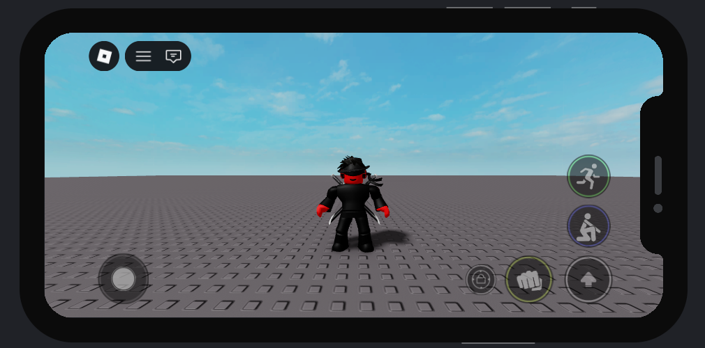

# DynamicTouchButton v1.0.1

A lightweight Luau module for Roblox that allows creating custom mobile buttons inside the default `TouchGui`.

## Features
- Custom button icons and transparency (`ImageTransparency`)
- Alignment presets (`RightTop`, `LeftBack`) with automatic layout frames
- `LayoutOrder` support (`setOrder`)
- Enable/disable individual buttons (`setEnabled`) and all buttons globally (`DynamicButtonsEnabled`)
- Change button background color dynamically (`setBackground`)
- Optional vibration support (HapticEffect)
- Click, InputBegan, and InputEnded events
- Automatic respawn detection (rebuild buttons on `CharacterAdded`)
- Full cleanup handled with Janitor
- Global registry to get buttons by name (`get`)
- Get UI instance directly (`getInstance`)

## Requirements
- Janitor module inside `ReplicatedStorage/Packages`

## Installation
Recommended structure:
```lua
ReplicatedStorage
 └── TouchGuiButtons
     ├── Packages
     │  └── Janitor.luau
     ├── DynamicTouchButton.luau
     └── Types.luau
```

## Usage

### Basic Example
```lua
local ReplicatedStorage = game:GetService("ReplicatedStorage")
local DynamicTouchButton = require(ReplicatedStorage.TouchGuiButtons.DynamicTouchButton)

-- Create a simple button
local btn = DynamicTouchButton.new({
    name = "Sprint",

    imageID = 1234567890, -- replace with your decal ID

    size = 90, -- 1 to 100
    
    order = 1,
    alignment = "RightTop",

    BackgroundColor = Color3.fromRGB(126, 255, 100),

    Clicked = function(button)
        print("Sprint clicked!")
    end,
})

-- Enable / disable button
btn:setEnabled(true)
```
### Full Example
```lua
local ReplicatedStorage = game:GetService("ReplicatedStorage")
local DynamicTouchButton = require(ReplicatedStorage.TouchGuiButtons.DynamicTouchButton)

-- CREATE BUTTON
local SprintButton = DynamicTouchButton.new({
    name = "Sprint",

    imageID = 1234567890,  -- replace with your decal ID
    size = 90,              -- 1 to 100

    order = 1,
    alignment = "RightTop",

    ImageTransparency = 0.2,
    BackgroundColor = Color3.fromRGB(255, 0, 0),

    Vibration = {
        HapticEffectType = Enum.HapticEffectType.UIClick,
        Delay = 0.15,
    },

    Clicked = function(button)
        print("[Sprint]: Clicked!", button.Name)
    end,

    InputBegan = function(input)
        print("[Sprint]: Input Began", input.UserInputType)
    end,

    InputEnded = function(input)
        print("[Sprint]: Input Ended", input.UserInputType)
    end,
})

-- CHANGE ORDER
SprintButton:setOrder(2)

-- CHANGE ALIGNMENT
SprintButton:Align("LeftBack")

-- CHANGE BACKGROUND COLOR
SprintButton:setBackground(Color3.fromRGB(100, 255, 100))

-- ENABLE / DISABLE BUTTON
task.delay(3, function()
    print("Disabling button...")
    SprintButton:setEnabled(false)
end)

task.delay(6, function()
    print("Enabling button...")
    SprintButton:setEnabled(true)
end)

-- GET BUTTON INSTANCE
local buttonInstance = SprintButton:getInstance()
print("Button UI instance:", buttonInstance)

-- GET BUTTON BY NAME (GLOBAL REGISTRY)
local foundButton = DynamicTouchButton.get("Sprint")
if foundButton then
    print("Found button in global registry:", foundButton.name)
end

-- ENABLE / DISABLE ALL BUTTONS
DynamicTouchButton.DynamicButtonsEnabled(false)
task.delay(2, function()
    DynamicTouchButton.DynamicButtonsEnabled(true)
end)

-- DESTROY BUTTON
task.delay(12, function()
    print("Destroying Sprint button...")
    SprintButton:Destroy()
end)
```
## Example image



## Notes
This module was made to be simple and beginner-friendly, but also useful for intermediate projects.  
If you find any bugs, improvements, or have suggestions, feel free to open an issue or contribute. Any help is appreciated!

## Rojo
To build the place from scratch, use:

```bash
rojo build -o "TouchGuiButtons.rbxlx"
```

Next, open `TouchGuiButtons.rbxlx` in Roblox Studio and start the Rojo server:

```bash
rojo serve
```